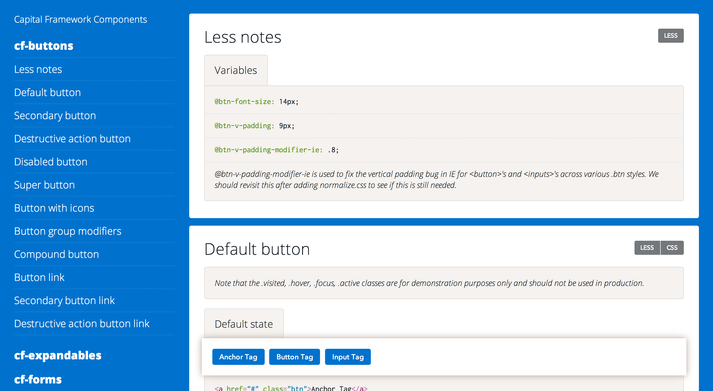

# Dox-ray Angular demo

An Angular playground to test out Dox-ray.




## Getting started

### Installing dependencies (one time)

Install [node.js](http://nodejs.org/) however you'd like.

Then Install [Grunt](http://gruntjs.com/) and [Bower](http://bower.io/):

```bash
$ npm install -g grunt-cli bower
```

### Developing

```bash
# Install/update npm and bower dependencies:
$ npm install
$ grunt vendor
# Build the JSON file using Dox-ray, this will be the model used in Angular:
$ grunt make-docs
# Compile the CSS and JS:
$ grunt
# You can manually compile the CSS or JS with the following tasks:
$ grunt cssdev
$ grunt jsdev
# You can also automatically compile CSS and JS by running the watch task:
$ grunt watch
```


## Getting involved

I welcome your feedback and contributions.
Please read [CONTRIBUTING](CONTRIBUTING.md).

To file a bug please us this handy [template](https://github.com/himedlooff/dox-ray-angular-demo/issues/new?body=%23%23%20URL%0D%0D%0D%23%23%20Actual%20Behavior%0D%0D%0D%23%23%20Expected%20Behavior%0D%0D%0D%23%23%20Steps%20to%20Reproduce%0D%0D%0D%23%23%20Screenshot&labels=bug).


----


## Open source licensing info

This projected is licensed under the terms of the [MIT license](LICENSE).
